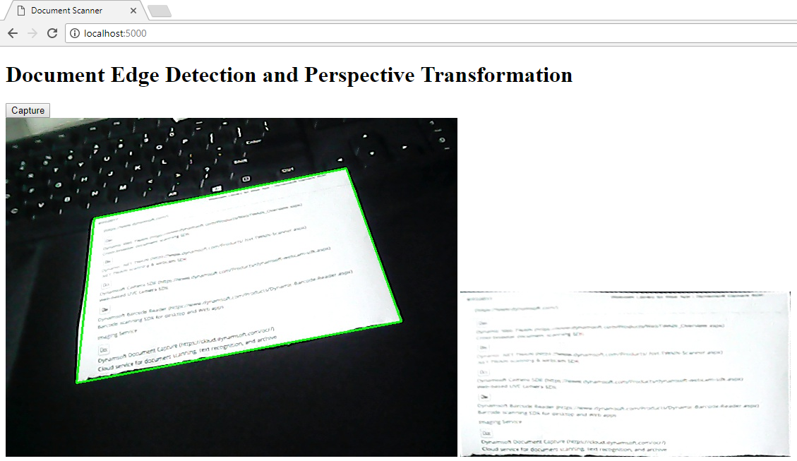

# Web Document Scanner
Use OpenCV-Python and Flask to create a web document scanner with a camera.

## Environment
* Python 3.5
* OpenCV 3.3.0

## How to Run 
1. Install **Flask**:

    ```
    pip install flask
    ```

2. Open **camera.py** and select a device:

    ```python
    self.cap = cv2.VideoCapture(2) # It should be 0 if you have only one device.
    ```

3. Run the app:

    ```
    python35 server.py
    ```
    

## Reference
* https://github.com/vipul-sharma20/document-scanner
* http://www.pyimagesearch.com/2014/08/25/4-point-opencv-getperspective-transform-example/
* http://www.pyimagesearch.com/2015/04/06/zero-parameter-automatic-canny-edge-detection-with-python-and-opencv/
* http://docs.opencv.org/3.1.0/dd/d49/tutorial_py_contour_features.html
* https://en.wikipedia.org/wiki/Ramer%E2%80%93Douglas%E2%80%93Peucker_algorithm

